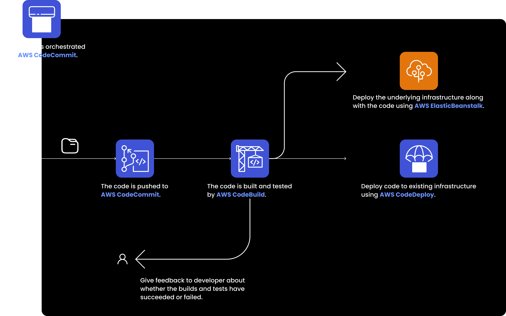
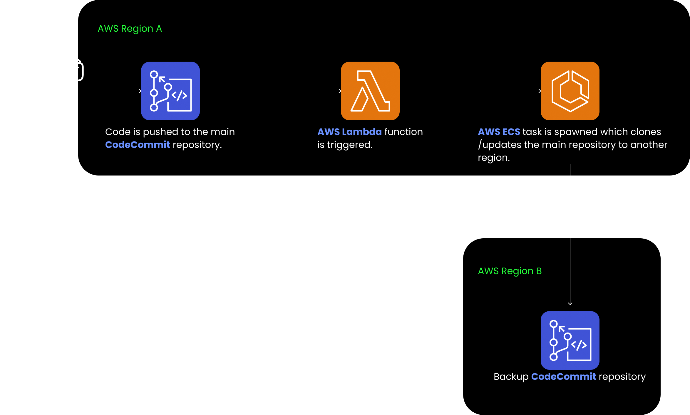
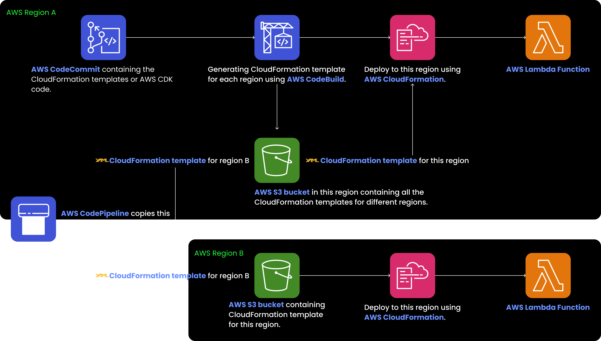

# CI/CD pipeline in AWS

> **Continuous Integration (CI)** - *The developer will push their code to a central repository. A build/test server will then pick up the code and startup builds and tests. The developer then gets feedback regarding the succeeded/failed builds and tests.* This complete process is called Continuous Integration.

> **Continuous Delivery (CD)** - *If all the builds and tests have succeeded in the CI process, the builds can then be deployed (to application servers) by a deployment server.* This complete process is called Continuous Delivery.

## AWS CodeCommit

AWS CodeCommit is a **Version Control System** (VCS like Github, Gitlab, BitBucket etc.) as a service offered by AWS. Features of AWS CodeCommit -

- Repositories can be scaled seamlessly as there is **no size limit**.
- Sourcecode in a repository **can be automatically encrypted using AWS KMS**.
- We can **leverage AWS IAM to configure access control to the repository** (We can enable cross AWS account access using AWS IAM and STS). Developers who have access, then **can connect to the CodeCommit repository using secure protocols like HTTPS (username and passed based) or SSH (SSH key based)**.
- CodeCommit **supports integration with CI tools** like Jenkins, AWS CodeBuild etc.
- It is a highly available service, completely managed by AWS.
- On any specific type of event happening in a CodeCommit repository -
    - *the notification can be collected in an AWS SNS topic.*
    - *an AWS Lambda function can be triggered.*
    - *an AWS CodePipeline managed CI/CD pipeline can be triggered.*
    
    **A CodeCommit repository can be integrated with AWS EventBridge**.
    
**Branch protection and Pull Request Approval Rules can be created using IAM policies.** (Also, AWS has created templates for  Pull Request Approval Rules)

Taking **backups** of a CodeCommit repository -
> Here AWS Lambda is used as an intermediate instead of AWS EventBridge, because to clone/update the CodeCommit repository, we need to know details about the commits. Notifications sent to AWS EventBridge doesn’t contain that.

## AWS CodePipeline

**AWS CodePipeline is a visual tool for orchestrating a CI/CD pipeline**. AWS CodePipeline divides a CI/CD pipeline into different phases -

- **Source** - can be AWS CodeCommit, S3, ECR, Github etc. To periodically check for changes in a CodeCommit repository, we can use AWS CodePipeline itself or **AWS CloudWatch Events** (**recommended since the check happens faster**).
- **Build** - we can integrate AWS CodeBuild, Jenkins CI etc.
- **Test** - AWS CodeBuild, AWS Device Farm (in case of iOS or android apps) can be integrated.
- **Deploy** - we can use AWS CodeDeploy, CloudFormation, S3, Elastic Beanstalk etc.
- **Invoke** - to invoke AWS Lambda functions or step functions. Using this phase, we can extend the capabilities of AWS CodePipeline.

From one phase of the pipeline, we can **sequentially** or **parallely** start another phase.

**A single stage has multiple action groups** like (Manual Approval, AWS S3, AWS CodeBuild etc). Manual approval can be defined at each stage. **Whenever a manual approval is required, we can trigger an SNS topic which will send an email to the reviewer**.

> Each phase can generate artifacts. Those artifacts are stored in an AWS S3 bucket and can be accessed by later phases.

A CodePipeline stage can be triggered via these 3 ways -

- **Events** - An event can be published in AWS EventBridge (for example, when a new commit is pushed to the source CodeCommit repository). The CodePipeline stage will then get triggered.
- **WebHooks** - This is an old way of triggering a CodePipeline stage. CodePipeline will expose an HTTP endpoint on behalf of you CI/CD pipeline. When the webhook payload reaches that endpoint, the CodePipeline stage will be triggered.
- **Polling** - CodePipeline will periodically poll for an event. This method is inefficient compared to the event-based methods and thus is not recommended.

AWS CodePipeline can be integrated with -

- **CloudWatch (AWS EventBridge)** - When a CI/CD pipeline phase fails or is cancelled, that event can be collected by CloudWatch Events.
- **AWS CloudTrail** - If you want to **audit API calls made during the CI/CD process**.
- **AWS CloudFormation Actions** and **Stacksets** - To manage AWS infrastructure.

**Multi-region deployments using CodePipeline** - Let’s take an example - Deploying an AWS Lambda function into multiple AWS regions using AWS CloudFormation. First of all, **in each of those regions, the S3 artifact buckets must be defined**. If you are using AWS Console to create the pipeline, then those S3 buckets will be created automatically, otherwise we need to create them manually. One good thing is - copying artifacts across S3 buckets in different regions is handled by CodePipeline automatically.
