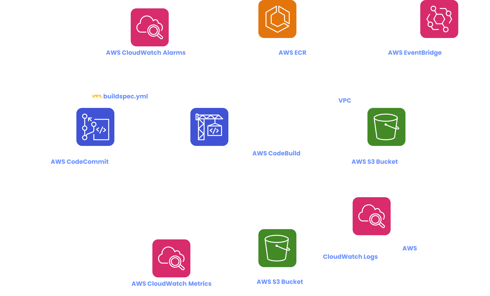
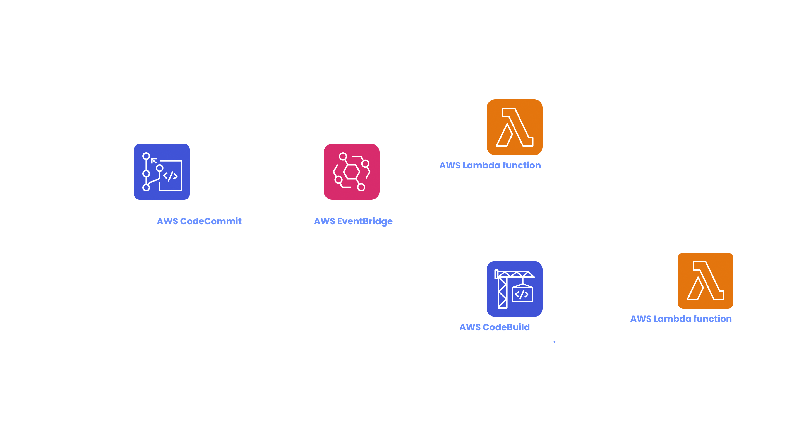
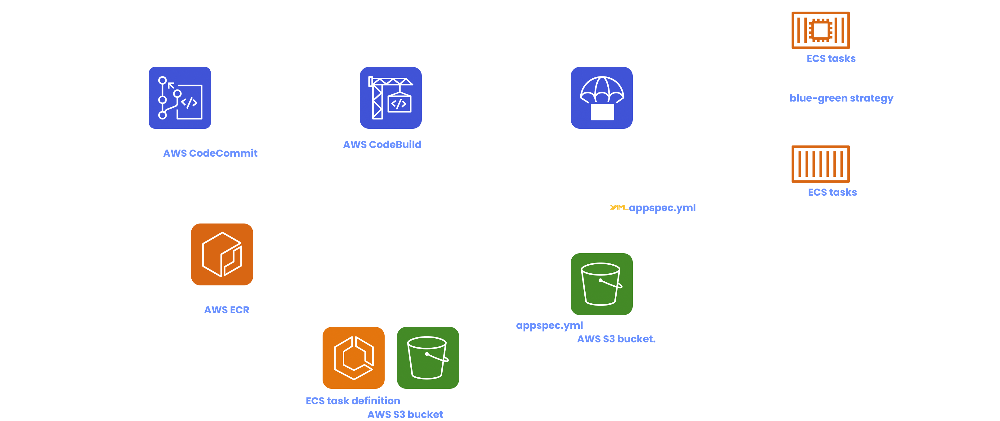
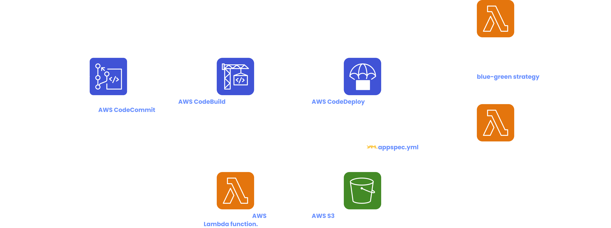

# CI/CD pipeline in AWS

> **Continuous Integration (CI)** - *The developer will push their code to a central repository. A build/test server will then pick up the code and startup builds and tests. The developer then gets feedback regarding the succeeded/failed builds and tests.* This complete process is called Continuous Integration.

> **Continuous Delivery (CD)** - *If all the builds and tests have succeeded in the CI process, the builds can then be deployed (to application servers) by a deployment server.* This complete process is called Continuous Delivery.

## AWS CodeCommit

AWS CodeCommit is a **Version Control System** (VCS like Github, Gitlab, BitBucket etc.) as a service offered by AWS. Features of AWS CodeCommit -

- Repositories can be scaled seamlessly as there is **no size limit**.
- Sourcecode in a repository **can be automatically encrypted using AWS KMS**.
- We can **leverage AWS IAM to configure access control to the repository** (We can enable cross AWS account access using AWS IAM and STS). Developers who have access, then **can connect to the CodeCommit repository using secure protocols like HTTPS (username and passed based) or SSH (SSH key based)**.
- CodeCommit **supports integration with CI tools** like Jenkins, AWS CodeBuild etc.
- It is a highly available service, completely managed by AWS.
- On any specific type of event happening in a CodeCommit repository -
    - *the notification can be collected in an AWS SNS topic.*
    - *an AWS Lambda function can be triggered.*
    - *an AWS CodePipeline managed CI/CD pipeline can be triggered.*
    
    **A CodeCommit repository can be integrated with AWS EventBridge**.
    
**Branch protection and Pull Request Approval Rules can be created using IAM policies.** (Also, AWS has created templates for  Pull Request Approval Rules)

Taking **backups** of a CodeCommit repository -
> Here AWS Lambda is used as an intermediate instead of AWS EventBridge, because to clone/update the CodeCommit repository, we need to know details about the commits. Notifications sent to AWS EventBridge doesn’t contain that.

## AWS CodePipeline

**AWS CodePipeline is a visual tool for orchestrating a CI/CD pipeline**. AWS CodePipeline divides a CI/CD pipeline into different phases -

- **Source** - can be AWS CodeCommit, S3, ECR, Github etc. To periodically check for changes in a CodeCommit repository, we can use AWS CodePipeline itself or **AWS CloudWatch Events** (**recommended since the check happens faster**).
- **Build** - we can integrate AWS CodeBuild, Jenkins CI etc.
- **Test** - AWS CodeBuild, AWS Device Farm (in case of iOS or android apps) can be integrated.
- **Deploy** - we can use AWS CodeDeploy, CloudFormation, S3, Elastic Beanstalk etc.
- **Invoke** - to invoke AWS Lambda functions or step functions. Using this phase, we can extend the capabilities of AWS CodePipeline.

From one phase of the pipeline, we can **sequentially** or **parallely** start another phase.

**A single stage has multiple action groups** like (Manual Approval, AWS S3, AWS CodeBuild etc). Manual approval can be defined at each stage. **Whenever a manual approval is required, we can trigger an SNS topic which will send an email to the reviewer**.

> Each phase can generate artifacts. Those artifacts are stored in an AWS S3 bucket and can be accessed by later phases.

A CodePipeline stage can be triggered via these 3 ways -

- **Events** - An event can be published in AWS EventBridge (for example, when a new commit is pushed to the source CodeCommit repository). The CodePipeline stage will then get triggered.
- **WebHooks** - This is an old way of triggering a CodePipeline stage. CodePipeline will expose an HTTP endpoint on behalf of you CI/CD pipeline. When the webhook payload reaches that endpoint, the CodePipeline stage will be triggered.
- **Polling** - CodePipeline will periodically poll for an event. This method is inefficient compared to the event-based methods and thus is not recommended.

AWS CodePipeline can be integrated with -

- **CloudWatch (AWS EventBridge)** - When a CI/CD pipeline phase fails or is cancelled, that event can be collected by CloudWatch Events.
- **AWS CloudTrail** - If you want to **audit API calls made during the CI/CD process**.
- **AWS CloudFormation Actions** and **Stacksets** - To manage AWS infrastructure.

**Multi-region deployments using CodePipeline** - Let’s take an example - Deploying an AWS Lambda function into multiple AWS regions using AWS CloudFormation. First of all, **in each of those regions, the S3 artifact buckets must be defined**. If you are using AWS Console to create the pipeline, then those S3 buckets will be created automatically, otherwise we need to create them manually. One good thing is - copying artifacts across S3 buckets in different regions is handled by CodePipeline automatically.

## AWS CodeBuild

**AWS CodeBuild takes sourcecode from a source repository (AWS CodeCommit, Github etc.) and generates build-artifacts from it.** The source repository must contain a *`buildspec.yml`* file (at the root of the repository. If it is in some other path, then we need to tell CodeCommit about it) which which contains the configuration for the build process. **The output logs generated during the process can be stored in AWS S3 or CloudWatch Logs. We can also use CloudWatch Metrics to monitor the build statistics. CloudWatch Alarms can be used in case of failed builds. AWS CodeBuild can also be integrated with EventBridge to send notifications regarding build status.**

> *CodeBuild creates a container in the backend. Sourcecode is loaded inside the CodeBuild container and the build process as mentioned in the `buildspec.yml` file, is run inside the container. You can use your custom container image or one of the template container images provided by AWS depending on your specific needs.*

By default the CodeBuild container is launched outside any VPC. But you can also make them launch inside your VPC (if during the build/testing process, you need to access resources inside the VPC).

**During the build process, we can cache files in S3 buckets**. After the build process is successfully finished, the build artifacts will be stored in S3 buckets.

**For debugging purposes, we can run CodeBuild in our local machine by using CodeBuild agent**.

Environment Variables required during the build process -

- **Default Environment Variables** - These are defined and provided by AWS. These environment variables mention the AWS region where the CodeBuild container will be created, build ARN, build ID and other metadata related to the process.
- **Static Custom Environment Variables** - These are defined at build time and can be overridden using the start-build API call.
- **Dynamic Custom Environment Variables** - These are secrets pulled from AWS SSM Parameter Store or AWS Secrets Manager during build time.

AWS CodeBuild interacts with other AWS resources in a secure manner by using encryption. Data encryption can be enabled for logs, cache and build artifacts.

**To enable data encryption for build artifacts, AWS CodeBuild needs access to AWS KMS.**

**CodeBuild Build Badges** - In the source repository (supported sources are AWS CodeCommit, Github and BitBucket), after the CodeBuild build has failed or succeeded, a badge is generated. This badge is an image showing the status of the CodeBuild build. **CodeBuild badges are scoped to branch level** (**showing the status of a branch**) and not commit level.

CodeBuild builds can be triggered by a **webhook**, **AWS Lambda function** or **AWS EventBridge**.

For a build process, CodeBuild can also generate a visual test report (shows percentage of testcases passed, which testcases have failed etc.) from a test report file. The test report file needs to be in a specific format which CodeBuild can understand (like JUnit XML, Cucumber JSON etc.). Configurations related to generating visual test reports can be written in the *`buildspec.yaml`* file.

## AWS CodeDeploy

> **AWS CodeDeploy is used to automate application deployments**. Application deployments can be done to **AWS EC2 instances, bare metal servers, AWS Lambda or AWS ECS**. **Application deployments are versioned** and AWS CodeDeploy provides us an option to **rollback to previous versions** (in case of failed deployments or unexpected behaviors of the application). We can also follow different deployment strategies - **blue-green** and **in-place** (All at once, Half at a time, One by one or we can create a custom in-place strategy). In order to use AWS CodeDeploy, the sourcecode must have an `*appspec.yml*` file at the repository root which will contain CodeDeploy configurations.
> 
- **Deploying to EC2 instances or bare-metal servers** - **CodeDeploy Agent must run on each of the target instances** since it is responsible for performing application upgrades. It needs to be installed and updated over time - which we can do manually | or we can AWS Systems Manager for this to happen automatically. **The instance should also have permission to access the S3 bucket containing the application build**.

    - [ ] Read about this point in more detail.

- **Deploying to AWS ECS** - AWS CodeDeploy can help us automate deployment of an ECS task definition to an ECS service. **The ECS service is required to have a loadbalancer attached**. Also, **it is our responsibility to have the container images ready**. **Only blue-green deployment strategy is available** in this case. But the **traffic shift can be done in multiple ways - linear, canary or all at once**.

    

    💡 *In the appspec.yml file, we **can create a 2nd test listener in the ALB to the replacement version of the ECS task**. This test listener can be used to test traffic flow.*
    
    During the deployment process, we are provided with some hooks - *BeforeInstall*, *AfterInstall*, *AfterAllowTestTraffic*, *BeforeAllowTraffic*, *AfterAllowTraffic* (**we can setup Lambda functions as trigger for these hooks**) and *Install* (the ECS service creating ECS task from the ECS task definition we provided), *AllowTestTraffic*, *AllowTraffic*.

- **Deploying to AWS Lambda** - AWS CodeDeploy is used to switch traffic from old to new alias of a lambda function. Like AWS ECS, only blue-green strategy is available in this case.

    

    During the deployment process, we can utilize 3 hooks provided by AWS CodeDeploy - *BeforeAllowTraffic*, *AfterAllowTraffic* (**we can trigger Lambda functions in case of these 2**) and *AllowTraffic*.